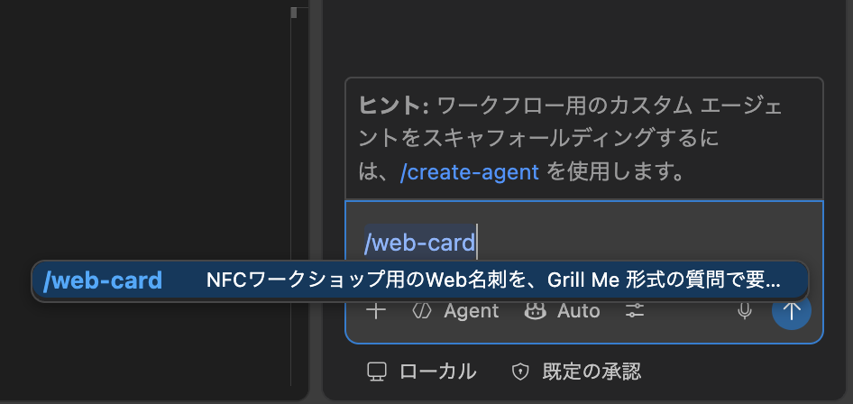
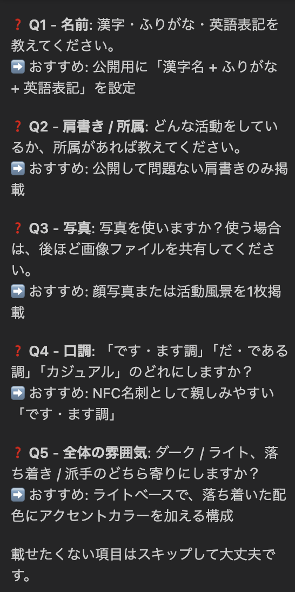
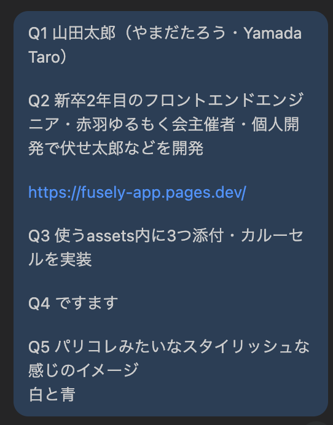

# 02. サイト制作

`starter/` を、自分のWeb名刺に書き換えます。静的な HTML / CSS / JS だけで作ります。

## 1. 要件を固める

先に「何を載せるか」を決めます。実装はそれからです。

載せるものを決めるときの観点は次のとおりです。

- 載せる個人情報
- 写真（1枚でも、複数枚のカルーセルでも可）
- 自己紹介文
- アピールしたい実績
- リンク（GitHub / X があると交流しやすい）
- デザイントークン（色、雰囲気、ダーク/ライトなど）

住所、電話番号、社外秘は載せないでください。公開してよい情報だけを使います。

### VS Code の Copilot を使う場合

チャットを Agent にして、次だけ送ります。プロンプトの中身を貼る必要はありません。

```
/web-card
```

名前や雰囲気が決まっていれば、続けて書いて構いません。

```
/web-card ダークめで、肩書きはフロントエンドエンジニア
```



Copilot が項目ごとに質問し、推奨案も出します。おまかせでよい項目は「それで」と返してください。
全部固めて確認するまで、実装は始まりません。

以下、チャットやり取り例





最終確認が返ってくるまでやり取りを続ける

### ChatGPT など別のAIを使う場合

[prompts/01-要件定義.md](../prompts/01-要件定義.md) を貼って要件を決め、[prompts/02-実装.md](../prompts/02-実装.md) で `starter/` を更新してください。`docs/` は触らないでください。

## 2. 自分で直すところ

AIの出力をそのまま公開せず、次だけは自分の目で確認してください。

| 場所 | 確認すること |
| --- | --- |
| 名前・肩書き | 表記ゆれや誤字がないか |
| 自己紹介 | 自分の言葉になっているか |
| 実績 | 誇張しすぎていないか |
| リンク | 自分のURLか。`https://` が付いているか。GitHub / X があるとよい |
| 写真 | 写ってよい写真か。パスが `./assets/...` か |

写真を使う手順は次のとおりです。

1. 画像を `starter/assets/` に置く（例: `photo.jpg`、複数なら `photo-1.jpg` など）
2. 1枚なら単一の `img`、複数ならカルーセルにする（`/web-card` に任せてもよい）
3. パスは必ず相対パス（`./assets/photo.jpg`）にする

## 3. ブラウザで確認する

`starter/index.html` をブラウザで開き、更新して確認します。

スマホでどう見えるかも見てください。ブラウザの幅を狭めるか、開発者ツールのスマホ表示を使います。NFCから開く画面は、ほぼスマホです。

色だけ変えたいときは `style.css` 先頭の変数をいじると早いです。

```css
--bg: #14110f;
--card: #1e1a17;
--text: #f3ebe3;
--accent: #e07a5f;
```

## 4. 公開前の点検

任意で [prompts/03-公開前チェック.md](../prompts/03-公開前チェック.md) を使えます。次が埋まっていれば先に進めます。

- [ ] プレースホルダー（Your Name など）が残っていない
- [ ] 画像パスが相対パスになっている
- [ ] リンクが開ける
- [ ] スマホ幅でも読める

細かい崩れはあとから直して大丈夫です。難しいものはサポートに聞いてください。

次は [03-GitHub公開.md](./03-GitHub公開.md) です。
