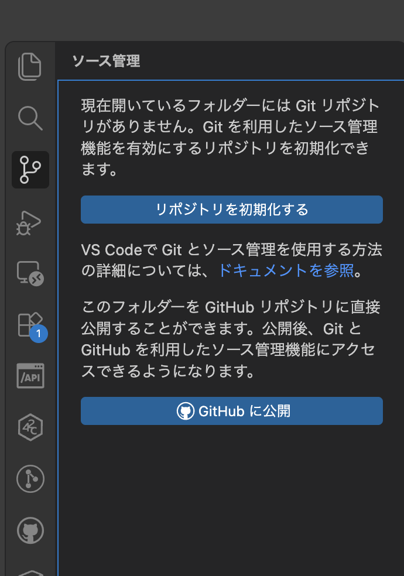
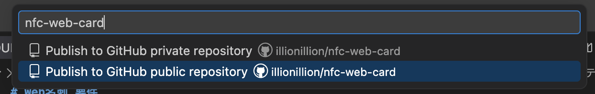
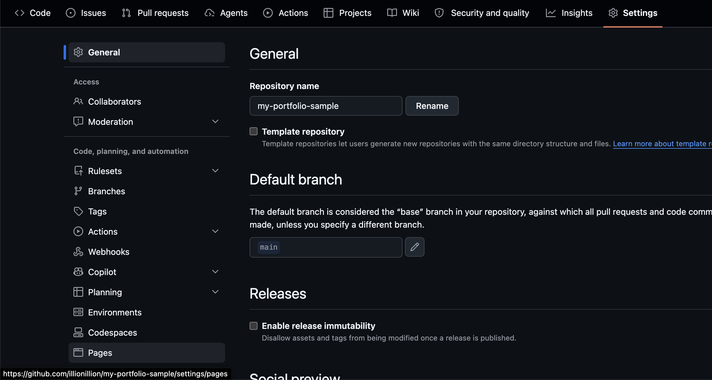
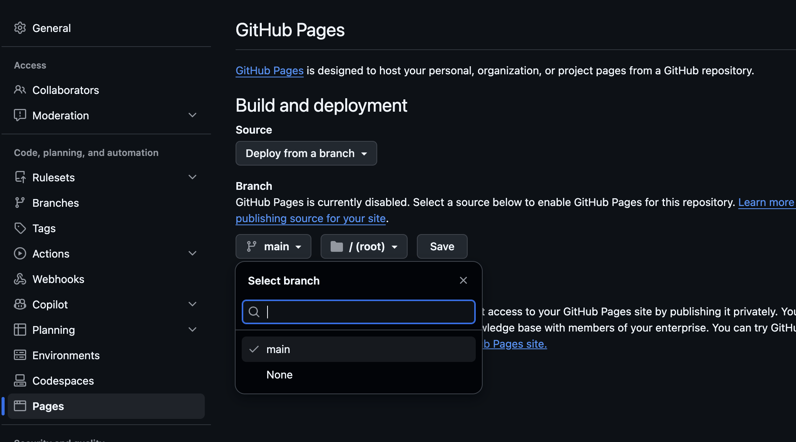
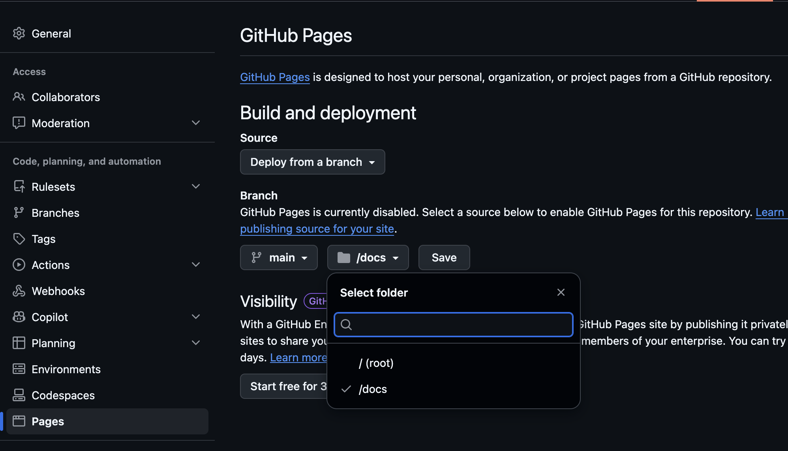
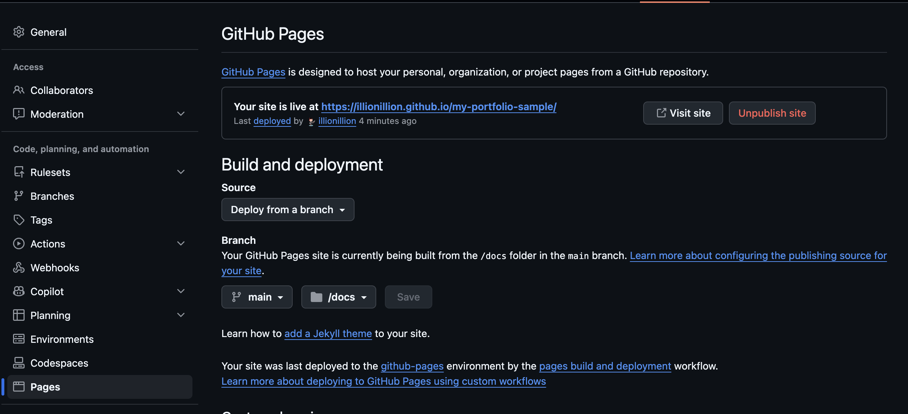

# 03. GitHub公開

作った名刺は、VS Code から **新しい公開リポジトリ** に上げます。
GitHub Pages は `docs/` だけを公開するので、`examples/` や手順書はサイトに出ません。

公開後のURLの形は次のとおりです。

```
https://<GitHubユーザー名>.github.io/nfc-web-card/
```

## 1. VS Code から GitHub に公開する

1. 左のサイドバーで **ソース管理**（枝分かれのアイコン）を開く
2. **GitHub に公開** を押す（「リポジトリを初期化する」ではない方）



3. リポジトリ名を入れる。デフォルトはフォルダ名になるので、必ず `nfc-web-card` に直す
4. **Publish to GitHub public repository** を選ぶ（private は選ばない）



5. 初回は GitHub へのログインや権限の許可が出ることがある。画面の指示に従う
6. 公開が終わると、ブラウザでリポジトリが開けるようになる

これでリポジトリの作成とファイルのアップロードは完了です。Web画面での新規作成や、ファイルのドラッグアップロードは不要です。

## 2. GitHub Pages を有効にする

ここからはブラウザで操作します。公開したリポジトリを開いてください。

1. リポジトリの `Settings` を開く
2. 左メニューの `Pages` を開く



3. Build and deployment の Source を `Deploy from a branch` にする
4. Branch で `main` を選ぶ



5. フォルダで `/docs` を選ぶ（`/ (root)` のままにしない）



6. `Save` を押す

公開されるのは `docs/` の中身だけです。名刺の編集は `starter/` 側で行い、GitHub Actions が `docs/` にコピーします。

## 3. Visit site が出るまで待つ

Save のあと、同じ Pages 画面の上部に **Visit site** が出るまで待ちます。数分かかることがあります。ページを更新しながら確認してください。



Visit site を押すと公開URLが開きます。URLの形は次のとおりです。

```
https://<GitHubユーザー名>.github.io/nfc-web-card/
```

Actions の画面を見なくても、Visit site が出ていれば公開は進んでいます。初めての公開で止まっているときは、リポジトリの `Actions` タブを開き、`CD` が動いているか、灰色なら `I understand my workflows, go ahead and enable them` を押してください。

`starter/` を直して再度公開（push）するたびに、`docs/` が更新されます。`docs/` を直接編集する必要はありません。

2回目以降、ソース管理から push できないときは、CD が `docs/` を先にコミットしただけです。VS Code のターミナルで次を実行してから、もう一度 push してください。

```bash
git pull --rebase --autostash
git push
```

## 4. 公開URLを確認する

Visit site から開くか、ブラウザで URL を直接開いて、次を確認します。

- [ ] 自分の名刺が表示される
- [ ] `examples` や手順書のファイル一覧にはなっていない
- [ ] 写真が出る（使っている場合）
- [ ] リンクを押せる
- [ ] スマホのブラウザでも開く

URLは控えておいてください。次のNFC書き込みで使います。

## うまくいかないとき

| 症状 | 確認すること |
| --- | --- |
| 「GitHub に公開」が出ない | VS Code に GitHub アカウントでサインインしているか見る |
| リポジトリ名が長い・違う | ZIP解凍フォルダ名がデフォルトになっている。`nfc-web-card` に直す |
| private で作ってしまった | リポジトリの Settings → General で Public に変更する |
| Visit site が出ない | 数分待ってページを更新する。Pages が `main` / `/docs` か見る。Actions で CD が失敗していないか見る |
| 404 になる | Pages のフォルダが `/docs` か、Actions が成功しているか、数分待ったかを見る |
| 完成例やガイドが出る | Pages の公開元が `/ (root)` になっていないか見る。`/docs` にする |
| 古い名刺のまま | `starter/` は更新されているか、Actions の最新実行が成功しているかを見る |
| CSSや写真が出ない | `starter` 側のパスが `./style.css` や `./assets/photo.jpg` かを見る |
| Actions が灰色 | `Actions` タブでワークフローの実行を許可する |
| push が拒否される | CD のコミットが先に乗っている。`git pull --rebase --autostash` のあと `git push` |

公開できたら [04-NFC書き込み.md](./04-NFC書き込み.md) へ進みます。
